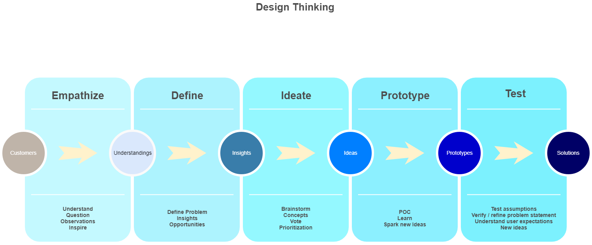

## Introduction

The aim of Design Thinking is to

- Create superior products and services.

- Lower the costs and risks associated with development of products and services.

- Get user and employee buy-in for the Design Process and to the resulting products and services.

Design Thinking is a creative-problem solving process. Design Thinking is performed to create better products and services by understanding how users are to interact with them and the conditions under which they are to operate.

Design Thinking

- Is for everyone.

- Is a user-centered approach to problem solving.

- Provides a means of exploring new ideas, new solutions & new alternatives.

- Allows designers and teams to apply their collective skills to large challenging problems.

- Is an iterative step-by-step process with amplified feedback loops.

- Represents a fundamental change, with ensuing challenges and opportunities for organizations.

- When practiced correctly leads to innovation.

## Design Thinking - Five Phase Model

There are a number variants of Design Thinking all of which embody similar principles. One of the most popular variants is the five-phase model proposed by researchers at Stanford this can be represented as

Note: The process is non linear. Typically the process is iterative and includes feedback loops between the five phases:

- Empathize – with your users to better understand and thus define the problem.

- Define – your users’ problems in the form of use cases and customer journeys which include the teams' insights.

- Ideate – create ideas for innovative solutions which challenge assumptions.

- Prototype – to start creating viable solutions and spark new ideas.

- Test – solutions to better understand user expectations and to spark new ideas.

In this model, our understanding of the users' expectations are constantly being questioned and knowledge is constantly being acquired. This allows us to iteratively redefine a problem and identify alternative solutions. These might not be apparent with our initial understanding of the problem domain.
